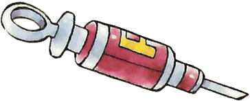

# PTCG Special Conditions

## Requirements

- Swift 5.3 Later

## About

各種状態異常についての効果・条件を定義しているモジュールです

| special condition | name_jp | image |
| :--- | :---: | :---: |
| Poisoned | (どく) |  |
| Burned | (やけど) |  |
| Paralyzed | (マヒ) |  |
| Asleep | (ねむり) |  |
| Confused | (こんらん) |  |

## How to use

